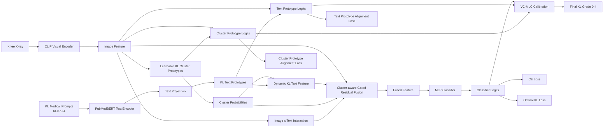

# 膝关节炎 KL 五分类方法说明

本文档用于解释当前项目中使用的方法、核心模块和创新点。任务目标是根据膝关节 X-ray 图像预测 Kellgren-Lawrence 分级，即 KL0、KL1、KL2、KL3、KL4 五分类。

## 1. 整体思路

当前模型不是单纯的图像分类模型，而是一个医学语义增强的多模态模型。

整体流程可以概括为：

```text
膝关节 X-ray 图像
→ CLIP visual encoder 提取图像特征
→ 与 KL 医学文本语义、KL 聚类原型进行对齐和融合
→ 得到最终 KL0-KL4 预测结果
```

项目中用到两类信息：

| 信息来源 | 作用 |
| --- | --- |
| X-ray 图像 | 提供真实影像表现，例如关节间隙、骨赘、骨硬化、畸形等 |
| KL 医学文本描述 | 提供每个 KL 等级对应的医学语义 |

因此模型不只是学习“图像属于第几类”，而是尝试学习：

```text
这张图像的影像表现，更接近哪一个 KL 医学语义等级？
```

## 2. CLIP 在项目中的作用

CLIP 原本是图像-文本双塔模型，包含：

```text
image encoder
text encoder
```

但在当前项目中，主要使用的是 CLIP 的图像编码器，也就是：

```text
Knee X-ray
→ CLIP visual encoder
→ image feature
```

这里的 `image feature` 是一个高维向量，用来表示膝关节 X-ray 的视觉特征。

需要注意的是，项目没有直接使用原始 CLIP 的文本编码器来处理 KL 医学描述，而是用 PubMedBERT 来编码医学文本。原因是原始 CLIP 的文本编码器主要面向自然图文数据，而 KL 分级描述包含较多医学术语。

更准确地说，当前项目是：

```text
CLIP visual encoder + PubMedBERT medical text encoder
```

## 3. PubMedBERT 是什么

PubMedBERT 是一个面向医学和生物医学领域的 BERT 模型。

普通 BERT 主要在通用文本上训练，例如百科、新闻、网页文本。PubMedBERT 主要在 PubMed 医学文献上训练，因此它更适合理解医学表达。

在本项目中，PubMedBERT 的作用是把 KL 等级的医学描述编码成向量。

例如：

```text
KL0: no joint space narrowing, no osteophytes
KL2: definite osteophytes and possible joint space narrowing
KL4: severe joint space narrowing, large osteophytes, bone deformity
```

这些文本经过 PubMedBERT 后，会得到对应的文本特征。每个 KL 等级有多条医学 prompt，项目会对同一等级的多条 prompt 取平均，形成 5 个 KL 文本原型：

```text
KL0 text prototype
KL1 text prototype
KL2 text prototype
KL3 text prototype
KL4 text prototype
```

这样模型可以利用医学语义辅助图像分类。

## 4. 图像如何对齐到 KL 语义

图像不是天然就能“聚到 KL 语义里”，而是通过训练逐渐对齐。

第一步，图像经过 CLIP visual encoder 得到图像向量：

```text
X-ray image → image feature
```

第二步，KL 医学文本经过 PubMedBERT 得到文本原型：

```text
KL prompts → PubMedBERT → KL text prototypes
```

第三步，模型计算图像特征和 5 个 KL 文本原型之间的相似度：

```text
image feature · KL0 text prototype
image feature · KL1 text prototype
image feature · KL2 text prototype
image feature · KL3 text prototype
image feature · KL4 text prototype
```

如果一张图的真实标签是 KL2，训练时会鼓励：

```text
image feature 更接近 KL2 text prototype
image feature 远离其他 KL text prototypes
```

这部分通过文本原型对齐损失实现。

除了文本原型，模型还有 5 个可学习的聚类原型：

```text
cluster prototype 0
cluster prototype 1
cluster prototype 2
cluster prototype 3
cluster prototype 4
```

这些聚类原型一开始是随机的，训练后会逐渐变成每个 KL 等级的图像特征中心。对于真实 KL2 的图像，模型会被约束为更靠近 `cluster prototype 2`。

所以“图像聚到 KL 语义里”本质上是两个对齐过程：

```text
图像特征 ↔ KL 文本语义原型
图像特征 ↔ KL 可学习聚类原型
```

## 5. 聚类感知动态文本生成

模型会先判断当前图像更接近哪些 KL 聚类原型。

例如一张图像可能得到如下聚类概率：

```text
KL0: 0.05
KL1: 0.10
KL2: 0.65
KL3: 0.18
KL4: 0.02
```

这说明模型认为该图像最像 KL2，但也有一部分 KL3 的表现。

然后模型用这个概率加权 5 个 KL 文本原型：

```text
dynamic text feature =
0.05 × KL0 text prototype
+ 0.10 × KL1 text prototype
+ 0.65 × KL2 text prototype
+ 0.18 × KL3 text prototype
+ 0.02 × KL4 text prototype
```

得到的 `dynamic text feature` 是当前样本专属的动态医学语义表示。

这个设计的意义是：不同 X-ray 图像不再使用同一个固定文本特征，而是根据图像自身表现动态选择相关的 KL 语义。

## 6. 聚类感知门控融合

聚类感知门控融合用于把图像特征和医学文本语义融合起来。

它接收四类信息：

```text
image feature
dynamic text feature
image feature × dynamic text feature
cluster probability
```

其中：

| 信息 | 含义 |
| --- | --- |
| `image feature` | X-ray 的视觉特征 |
| `dynamic text feature` | 当前图像对应的动态 KL 医学语义 |
| `image × text interaction` | 图像和文本之间的交互关系 |
| `cluster probability` | 图像接近各 KL 等级的软分配概率 |

门控模块会输出一个 gate，用来控制文本语义注入到图像特征中的比例：

```text
fused feature = image feature + gate × dynamic text feature
```

可以把 gate 理解成一个自动调节开关。它会根据每张图像的情况判断：

```text
当前样本应该更多依赖图像特征？
还是更多参考医学文本语义？
还是更多参考 KL 聚类概率？
```

因此，聚类感知门控融合不是简单拼接图像和文本，而是让模型根据样本自身的 KL 语义分布自适应融合多模态信息。

## 7. 有序监督学习五分类

普通五分类会把 KL0、KL1、KL2、KL3、KL4 当成 5 个互相独立的类别。

但 KL 分级不是普通类别，它有明确的严重程度顺序：

```text
KL0 < KL1 < KL2 < KL3 < KL4
```

因此不同错误的严重程度不同。

例如真实标签是 KL2：

```text
预测成 KL1 或 KL3：相邻等级错误
预测成 KL0 或 KL4：远距离等级错误
```

普通 CrossEntropy 损失只关心预测是否正确，不直接建模这种等级距离。

有序监督的作用是告诉模型：

```text
KL 等级是严重程度递增的
远距离错分比相邻错分更不合理
```

项目中使用的有序损失可以理解为让模型学习多个等级阈值。

例如真实标签为 KL3，可以理解为：

```text
严重程度 > KL0
严重程度 > KL1
严重程度 > KL2
严重程度 不大于 KL3
```

这样模型不仅学习“属于哪一类”，还学习“严重程度超过了哪些等级阈值”。

## 8. 训练损失

完整模型的训练目标由多项损失组成：

```text
total loss =
CE classification loss
+ ordinal KL loss
+ text prototype alignment loss
+ cluster prototype alignment loss
```

各部分含义如下：

| 损失 | 作用 |
| --- | --- |
| CE classification loss | 学习 KL0-KL4 五分类 |
| ordinal KL loss | 建模 KL 等级的严重程度顺序 |
| text prototype alignment loss | 让图像特征靠近对应 KL 文本语义 |
| cluster prototype alignment loss | 让图像特征靠近对应 KL 聚类中心 |

这几部分共同约束模型，使其同时学习图像分类、医学语义对齐和 KL 有序关系。

## 9. VC-MLC 校准模块

VC-MLC 是当前项目中最终采用的后训练校准模块。

全称可以写为：

```text
Validation-Calibrated Multi-Logit Consensus
```

中文可以理解为：

```text
验证集校准的多路 logits 共识策略
```

其中：

| 缩写 | 含义 |
| --- | --- |
| Validation-Calibrated | 使用验证集选择融合参数，不使用测试集标签 |
| Multi-Logit | 同时使用多路预测 logits |
| Consensus | 将多路预测证据融合成一个最终共识判断 |

### 9.1 为什么需要 VC-MLC

完整模型在前向传播时并不是只产生一个分类结果，而是同时产生多种预测证据。

这些证据来自不同模块：

```text
分类头：根据融合特征直接判断 KL 等级
文本原型：根据图像和 KL 医学文本语义的相似度判断 KL 等级
聚类原型：根据图像和 KL 聚类中心的相似度判断 KL 等级
```

三路证据各有优缺点：

| 证据 | 优点 | 可能的问题 |
| --- | --- | --- |
| 分类头 logits | 直接针对训练标签优化，分类能力强 | 容易受单一数据集分布影响 |
| 文本原型 logits | 引入 KL 医学语义，可解释性较好 | 文本描述和图像表现不一定完全一一对应 |
| 聚类原型 logits | 反映图像在 KL 特征空间中的位置 | 聚类中心可能受类别不均衡影响 |

如果只使用分类头 logits，相当于丢掉了文本语义和聚类原型两路信息。VC-MLC 的作用就是把这三路信息重新融合起来，让最终预测同时参考分类判断、医学语义判断和聚类判断。

### 9.2 三路 logits 分别是什么

完整模型会产生三路 logits：

```text
classifier logits
text prototype logits
cluster prototype logits
```

其中：

| logits | 来源 |
| --- | --- |
| `classifier logits` | 融合特征经过 MLP 分类器得到 |
| `text prototype logits` | 图像特征和 KL 文本原型相似度得到 |
| `cluster prototype logits` | 图像特征和 KL 聚类原型相似度得到 |

更具体地说：

```text
classifier logits = MLP(fused feature)
text prototype logits = image feature · KL text prototypes
cluster prototype logits = image feature · KL cluster prototypes
```

三路 logits 的维度都是 `[batch_size, 5]`，对应 KL0-KL4 五个类别。

### 9.3 VC-MLC 怎么计算

VC-MLC 在验证集上搜索三路 logits 的融合权重。

基础形式是：

```text
final logits =
classifier logits
+ α × text prototype logits
+ β × cluster prototype logits
```

其中：

| 参数 | 含义 |
| --- | --- |
| `α` | 文本原型 logits 的权重 |
| `β` | 聚类原型 logits 的权重 |
| `τ` | 温度系数，用于调整 logits 分布的尖锐程度 |

带温度系数后可以写成：

```text
final logits =
(classifier logits + α × text prototype logits + β × cluster prototype logits) / τ
```

然后再做 softmax 和 argmax 得到最终类别：

```text
prediction = argmax(softmax(final logits))
```

### 9.4 参数怎么选

VC-MLC 不使用测试集标签调参。它只在验证集上搜索参数组合。

当前项目中主要搜索：

```text
α: text prototype weight
β: cluster prototype weight
τ: temperature
```

搜索流程是：

```text
for α in candidate_text_weights:
    for β in candidate_cluster_weights:
        for τ in candidate_temperatures:
            在验证集上计算 final logits
            计算验证集 Macro F1
选择验证集 Macro F1 最好的 α、β、τ
```

选好参数后，在测试集上固定使用这组参数，不再根据测试集调整。

### 9.5 为什么使用 Macro F1 作为选择目标

膝关节炎 KL 五分类存在类别不均衡问题，尤其是 KL4 样本较少。单独使用 Accuracy 可能会偏向多数类。

Macro F1 会对每个类别先分别计算 F1，再取平均，因此更能反映少数类表现。

所以当前项目默认用验证集 Macro F1 选择 VC-MLC 参数。

### 9.6 和 TTA 的关系

VC-MLC 里还使用了水平翻转 TTA。

测试时会分别计算：

```text
原图 logits
水平翻转图 logits
```

然后对 logits 做平均：

```text
tta logits = (original logits + hflip logits) / 2
```

再进入 VC-MLC 的三路 logits 融合。

水平翻转 TTA 的作用是降低模型对左右方向和局部裁剪差异的敏感性。由于膝关节 X-ray 左右翻转后医学语义基本不变，因此该 TTA 是合理的。

### 9.7 VC-MLC 和普通后处理有什么区别

VC-MLC 不是简单地对预测结果投票，也不是只做温度缩放。

它和普通后处理的区别在于：

| 方法 | 使用信息 | 是否利用多模态证据 |
| --- | --- | --- |
| 普通 argmax | 只用分类头 logits | 否 |
| 普通温度缩放 | 只调整 logits 尖锐程度 | 否 |
| 普通 TTA | 平均多个图像视图的输出 | 主要是图像侧 |
| VC-MLC | 分类头 logits + 文本原型 logits + 聚类原型 logits + TTA | 是 |

因此 VC-MLC 的核心不只是校准，而是把模型内部不同来源的预测证据做验证集自适应融合。

该模块的目的不是重新训练模型，而是让每个数据集根据验证集自动选择更合适的多模态证据比例。

当前结果中，VC-MLC 在三个数据集上都比 full 模型有提升。

### 9.8 VC-MLC 的创新点体现

VC-MLC 的创新点主要体现在三个方面。

第一，它把完整模型中的中间预测证据显式保留下来，而不是只使用最终分类头。这样可以同时利用：

```text
融合特征的分类判断
图像-医学文本语义相似度
图像-KL 聚类中心相似度
```

第二，它使用验证集自动选择三路证据的权重。不同数据集的图像质量、类别分布和标注边界不同，因此三路证据的重要性也不同。VC-MLC 可以为每个数据集自适应选择更合适的证据比例。

第三，它在不重新训练模型的情况下提升跨数据集稳定性。对于医学小样本任务，重新训练或复杂微调容易过拟合，验证集校准的多路证据融合更稳。

论文中可以将该创新点表述为：

```text
提出 Validation-Calibrated Multi-Logit Consensus（VC-MLC）策略，
在验证集上自适应校准分类头、文本原型和聚类原型三路 logits 的融合权重，
充分利用模型内部的视觉判别证据、医学语义证据和聚类结构证据，
从而提升多数据集上的泛化稳定性。
```

## 10. 方法流程图

下面是当前项目方法流程的文字版流程图。



## 11. 当前创新点

当前项目的主要创新点可以概括为以下几项。

### 11.1 医学文本原型增强的 CLIP 框架

项目不是只用 CLIP 图像特征做分类，而是用 PubMedBERT 构建 KL 医学文本原型，把医学语义引入图像分类过程。

可以表述为：

```text
使用 PubMedBERT 构建 KL 分级医学语义原型，
将普通视觉分类任务转化为图像-医学语义对齐任务。
```

### 11.2 聚类感知动态文本生成

模型根据图像到 KL 聚类原型的软分配概率，动态生成样本级文本语义。

可以表述为：

```text
利用图像到 KL 聚类原型的软分配结果，
自适应生成样本级 KL 医学语义表示。
```

### 11.3 聚类感知门控残差融合

模型显式融合图像特征、动态文本特征、跨模态交互和聚类概率，不是简单 concat 或直接相加。

可以表述为：

```text
设计聚类感知门控残差融合模块，
自适应融合视觉特征、医学文本语义和 KL 聚类分布。
```

### 11.4 KL 有序监督

KL0-KL4 是严重程度递增的等级，因此项目加入有序监督来减少远距离错分。

可以表述为：

```text
引入 KL 分级有序监督，
显式建模 KL0-KL4 的严重程度递进关系。
```

### 11.5 VC-MLC 多路 logits 共识

VC-MLC 使用验证集校准三路 logits 的融合比例，使不同数据集可以自适应选择图像分类证据、文本语义证据和聚类原型证据。

可以表述为：

```text
提出验证集校准的多路 logits 共识策略，
自适应融合分类头、文本原型和聚类原型三类预测证据。
```

更完整的创新点表述为：

```text
不同于只使用最终分类头的常规推理方式，
VC-MLC 将分类头 logits、文本原型 logits 和聚类原型 logits 视为三类互补证据，
并通过验证集选择融合权重和温度系数。
该策略不使用测试标签，也不需要额外训练，
能够针对不同数据集的分布差异自适应调整多模态证据比例。
```

它在当前项目中的实际作用是：

```text
full 模型负责学习图像-医学语义-聚类结构的联合表示；
VC-MLC 负责在推理阶段把这些表示产生的多路判断结果校准成最终预测。
```

## 12. 为什么三个数据集效果不同

不同数据集效果不一致，主要由数据分布和标注差异造成。

### 12.1 类别不均衡

私有数据集中 KL4 样本很少。少数类样本不足时，模型难以稳定学习该类别的特征。Macro F1 会受到少数类表现的明显影响。

### 12.2 KL 边界模糊

KL1/KL2、KL2/KL3 之间本来就存在边界模糊问题。不同标注者或不同数据集可能对相邻等级的判断标准不完全一致。

### 12.3 图像采集域差异

不同数据集可能来自不同设备、曝光条件、裁剪方式、分辨率和体位。这些差异会造成域偏移，使同一个模型在不同数据集上的表现不同。

### 12.4 验证集和测试集也可能不完全同分布

小数据集尤其容易出现验证集和测试集分布不一致的问题。因此某些方法在验证集上有效，但在测试集上不一定继续提升。

## 13. 推荐论文写法

可以将当前方法概括为：

```text
本文提出一种面向膝关节炎 KL 五分类的医学语义增强 CLIP 框架。
该方法利用 PubMedBERT 构建 KL 医学文本原型，
通过聚类感知动态文本生成和门控残差融合实现图像-语义自适应对齐，
并结合 KL 有序监督与验证集校准的多路 logits 共识策略，
提升多数据集上的分类性能和泛化稳定性。
```

方法名称可以考虑：

```text
OCM-CLIP: Ordinal Cluster-aware Medical Prompt CLIP
```

其中：

| 缩写 | 含义 |
| --- | --- |
| Ordinal | KL 分级是有序严重程度 |
| Cluster-aware | 使用 KL 聚类原型和聚类概率 |
| Medical Prompt | 使用 KL 医学文本描述 |
| CLIP | 使用 CLIP visual encoder 和图文对齐思想 |
